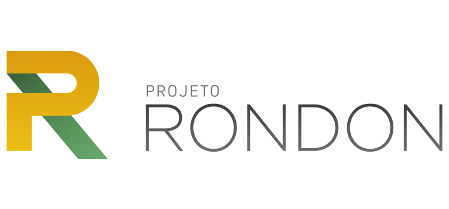

# CertificaRondon



**CertificaRondon** é um software semiautomatizado desenvolvido para criar certificados personalizados para os participantes de oficinas do Projeto Rondon. Ele permite a inserção de informações em uma planilha Excel e a geração de certificados em PDF de forma prática e eficiente.

## Funcionalidades

- Importar dados (como coordenação, período, município, operação, oficinas, carga horária, etc.) de um arquivo Excel.
- Gerar certificados personalizados em formato PDF.
- Processamento em lote de forma rápida e automatizada.

## Requisitos do Sistema

- **Python 3.9 ou superior** (apenas para quem optar por rodar o código-fonte)
- Dependências utilizadas (algumas podem ser nativas do Python):
  - `pandas`
  - `comtypes`
  - `PyMuPDF`
  - `python-pptx`
  - `reportlab`
  - `tqdm`

## Instalação

### 1. Usando o Arquivo Executável
1. Faça o download dos seguintes arquivos:
   - [CertificaRondon.exe](https://drive.google.com/file/d/1apTd8xMx59m1DZWCKo3_VqvH2h0Vdggc/view?usp=drive_link)
   - [Dados.xlsx](Dados.xlsx)
   - [certificado_rondon.pptx](certificado_rondon.pptx)
2. Preencha o arquivo `Dados.xlsx` com as informações dos participantes.
3. Execute o arquivo `CertificaRondon.exe` e siga as instruções na tela.
4. Os certificados em PDF serão gerados no local selecionado.

### 2. Usando o Código-Fonte
1. Clone este repositório:
   ```bash
   git clone https://github.com/Lucianov-TheFarmer/CertificaRondon.git

2. Instale as dependências
pip install pandas comtypes pymupdf python-pptx reportlab tqdm

3. Execute o script:
python CertificaRondon.py

4. Selecione os arquivos necessários (Dados.xlsx, certificado_rondon.pptx) e o local para salvar os certificados.

## Estrutura do repositório

CertificaRondon/
├── CertificaRondon.py          # Código-fonte principal
├── Dados.xlsx                  # Modelo de planilha Excel
├── certificado_rondon.pptx     # Template do certificado
├── README.md                   # Documentação do projeto
├── LICENSE                     # Licença MIT com cláusula de atribuição
└── assets/
    └── logo_projeto_rondon.png # Logo do Projeto Rondon

## Licença

Este projeto está licenciado sob os termos da licença **MIT com atribuição**.  
Consulte o arquivo [LICENSE](LICENSE) para mais detalhes.

## Contribuições

Contribuições são bem-vindas! Caso tenha sugestões ou melhorias, entre em contato pelo e-mail:
vitor.silva7@estudante.ufla.br

## Agradecimentos

À Universidade Federal de Lavras (UFLA) e a todos os rondonistas que contribuem para o sucesso do Projeto Rondon, lição de vida e de cidadania!
